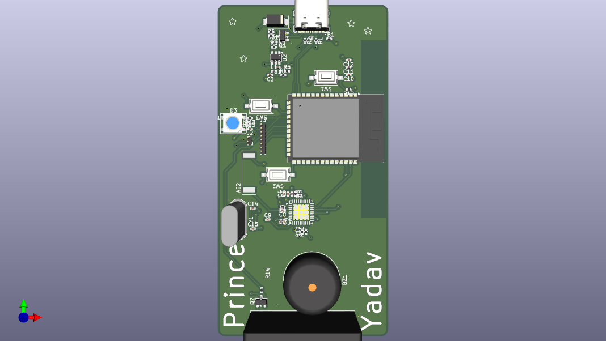
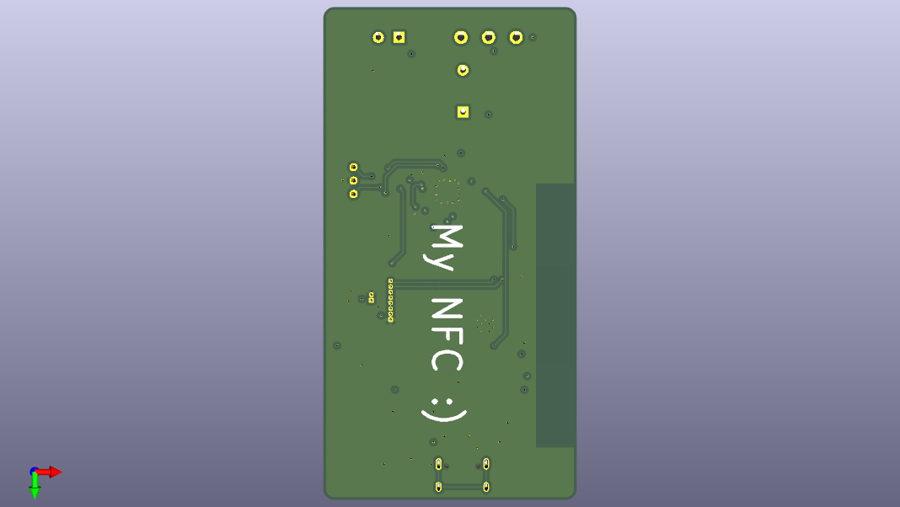
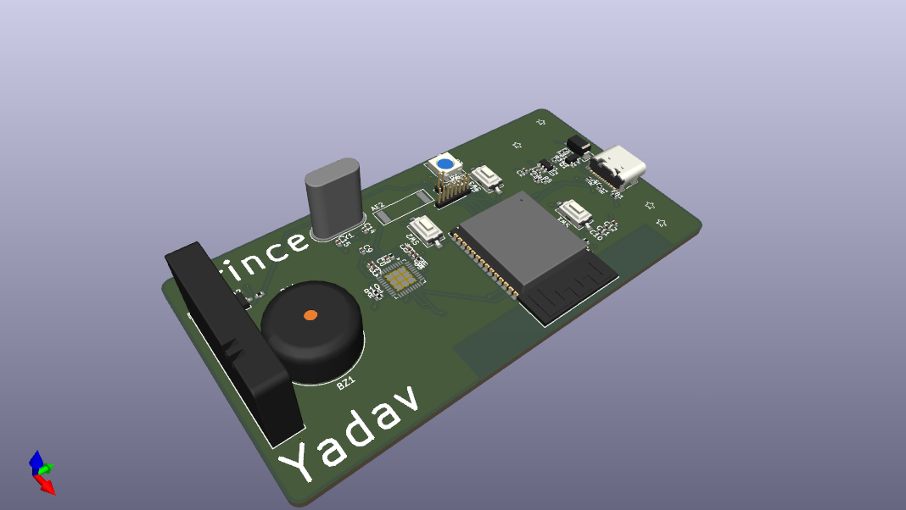
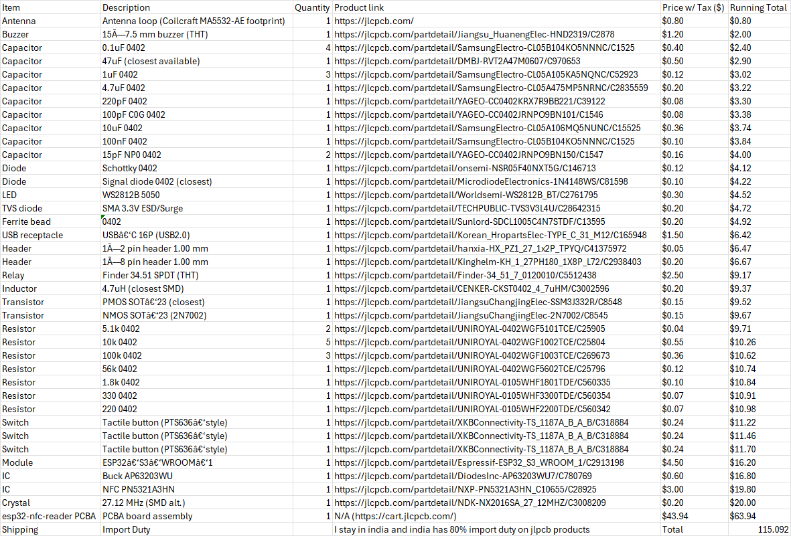
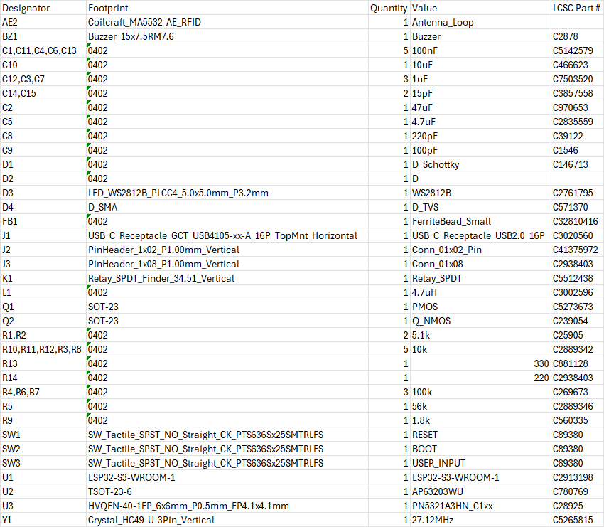

# ESP32 NFC Reader

This is my very own prototype of an NFC Reader, built using the ESP32 microcontroller! It’s a compact, wireless module designed to read and interact with NFC tags and cards.

# How to Use
Plug in a USB cable into the receptacle. Install the ESP32IDE for configuration of the firmware.

# Images

# BOM

